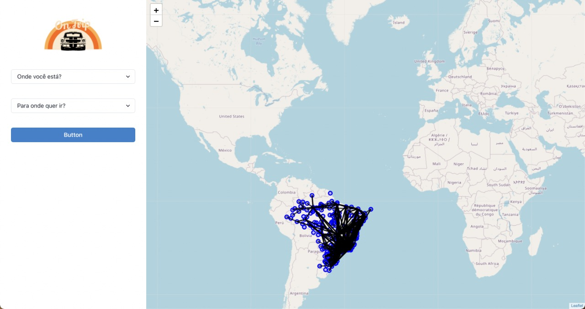

# On Trip


**Número da Lista**: 4<br>
**Conteúdo da Disciplina**: Grafos2<br>

## Alunos

|Matrícula | Aluno |
| -- | -- |
| 18/0127641  | Matheus Afonso de Souza |

## Sobre

Caso você seja uma pessoa que viaje muito e queira economizar seu tempo de travessia, utilize o On Trip para descobrir qual o menor caminho para seu destino. Atualmente nossa disponibilidade está disponível somente nos aeroportos brasileiros, mas futuramente vamos disponibilizar mundialmente.

## Apresentação
A apresentação do projeto pode ser vista no seguinte [link](https://youtu.be/-pZ7EoBfNvI). Além disso ela também está presente no repositório.

## Screenshots




## Instalação

**Linguagem**: 

- Backend:
    - Python, utilizando FastAPI para setup do servidor e disponibilização dos endpoints HTTP.
    - Docker e Docker Compose para realiza conteinerização do ambiente de desenvolvimento e, assim, evitar erros relacionados a ambiente.
- Frontend:
    - Javascript, utilizando ReactJS como framework para montar a interface visual da aplicação.
    - Comunicação com o backend utilizando axios.
    - Disponibilização de mapa e linhas de viagem com Leaflet.

Para executar o projeto, você precisa ter o node.js, Docker e Docker Compose instalados. Caso já possua os pré-requisitos, utilize os seguintes comandos abaixo:

```jsx
# Para subir o backend
docker-compose up --build

# Para subir o frontend
npm install
npm start
```

## Uso

Para descobrir qual a rota da sua viagem, selecione nos dois inputs na página a origem e o destino da viagem, você pode encontrar o código do aeroporto clicando no círculo azul no mapa (irá abrir um popup com o código do aeroporto)

Caso ocorra um erro, será apresentado um aviso de erro, caso contrário o caminho mais rápido irá aparecer em vermelho :)
